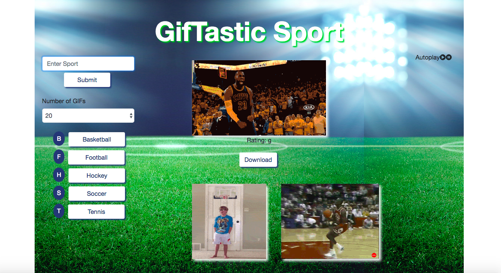

# Giftastic

<!-- Put a description of what the project is -->
Learning APIs, AJAX and jQuery: Interacting with APIs thorugh AJAX calls, Utilizing the response object received from the AJAX call, jQuery Event handlers, Dymanically creating html elements

## Link to deployed site
<!-- make a link to the deployed site --> 
<!-- [What the user will see](the link to the deployed site) -->
[Giftastic-Sport](https://ajitas.github.io/GifTastic/)

## Images
<!-- take a picture of the image and add it into the readme  -->
<!--  -->


## technology used
<!-- make a list of technology used -->
<!-- what you used for this web app, like html css -->

<!-- 
1. First ordered list item
2. Another item
⋅⋅* Unordered sub-list. 
1. Actual numbers don't matter, just that it's a number
⋅⋅1. Ordered sub-list
4. And another item. 
-->
1. HTML
2. CSS/BootStrap
    * box-shadow
    * text-shadow
    * grid layout
    * pagination
    * dropdownlist
3. Javascript
    * control structure
    * data structures
    * functions
4. jQuery
    * Event Handling
    * Dynamically creating new html elements
    * Appending and removing dynamically created html elements to other html elements
    * Providing attributes to dynamically created html elements
    * Dynamically removing html elements
5. AJAX
    * Building queryString for the AJAX call to APIs
    * Utilizing the response received from the AJAX call
        * In this particular case, playing and pausing GIFs


## code snippets
<!-- put snippets of code inside ``` ``` so it will look like code -->
<!-- if you want to put blockquotes use a > -->

This code snippet shows how the GIFs are displayed on the page. We are grabbing the search term to be used in the querystring for AJAX call to the giphy API from the button that we click. Then we are extracting the count of images to be shown from the dropdownlist and according to the the count, the number of pages to be shown in pagination area is decided. We make the AJAX call and once the response is received, we decide which images are to be shown on the current page(pagination). We created the required html elements dynamically and provide appropriate classes and attributes to them and then append it to the page.

```
//retrieves gifs from api and displays them
function displayGIFs() {

    //grab the number of gifs count to retrieve from the dropdownlist
    var countGIFs = $('#ddlCount option:selected').text();

    //grab the searchItem according to which sport button was clicked
    var searchItem = $(this).attr("data-name");

    //if searchItem is undefined i.e we are coming to this function by 
    //clicking on the pagination page link and not from the click of the button
    //set the searchItem to previously set searchTerm
    if(!searchItem)
        searchItem = searchTerm;

    //if we are coming to this function by 
    //clicking on the sport button and not from pagination page link
    //set searchTerm to searchItem and reset the pageCount to 0 since this will bring us to the first page
    else{
        searchTerm = searchItem;
        pageCount =0;
    }
    
    //prepare the query string
    var queryURL = "https://api.giphy.com/v1/gifs/search?limit="+countGIFs+"&q=" +searchItem + "&api_key=2Jh9XUPDdIoA6ZkPV02UBu2zpAP3nNzb";

    //ajax call
    $.ajax({
      url: queryURL,
      method: "GET"
    })
    //promise
    .then(function(response) {

      //console.log the response.data
      console.log(response.data);
      //reference to response.data
      var result = response.data;

      //empty the gifs shown currently
      $("#gif-area").empty();
      //empty the pagination li items
      $("#pagination-ul").empty();
      //pick the right slot of image numbers to show (1-5, 5-10, 10-15..) and loop through
      for (var i = pageCount*5; i < (pageCount+1)*5; i++) {

          //createa a div to hold the gif, raiting and the download button
          var newDiv = $("<div>");
          //give the new div class of gif-div
          newDiv.attr("class","gif-div");

          //Retrieves the Rating Data
          var rating = result[i].rating;
          // Creates an element to have the rating displayed
          var ratingP = $("<p>");
          //Provide the new p element a text
          ratingP.text("Rating: " +rating);
          
          //create a new image element
          var gifImage = $("");
          //set src to result[i].images.fixed_height_still.url
          gifImage.attr("src",result[i].images.fixed_height_still.url);
          //give it a class of gif and img-fluid(for responsiveness)
          gifImage.attr("class","gif img-fluid");
          //set the animate src of image to result[i].images.fixed_height.url
          gifImage.attr("data-animate",result[i].images.fixed_height.url);
          //set the still src of image to result[i].images.fixed_height_still.url
          gifImage.attr("data-still",result[i].images.fixed_height_still.url);
          //set the current state of gif to still
          gifImage.attr("data-state","still");

          //create an anchor tag to wrap around the download button and give it an attribute of download
          var link = $("<a download>");
          //set the href to the image url
          link.attr("href",result[i].images.original.url);
          //set taget to _blank to open it in a new tab
          link.attr("target","_blank");

          //create a button 
          var downloadButton = $("<button>");
          //give it class of btn
          downloadButton.attr("class","btn");
          //give it a text of download
          downloadButton.text("Download");
          //append it to the anchor tag we created
          link.append(downloadButton);

          //append the newly created elements of image,rating and download button to newDiv
          newDiv.append(gifImage,ratingP,link);
          
          //append the newDiv to gif-area
          $("#gif-area").prepend(newDiv);
      }

      //create links for pagination pages on the bottom
      //divide the total gifs by 5 to see how many pages are needed
      //for each page
      for(var i =0;i<countGIFs/5;i++){
          //create li tag
          var page = $("<li>");
          //give it a class of page-item
          page.attr("class","page-item");
          //create anchor tag
          var pageLink = $("<a>");
          //give it a class of page-link
          pageLink.attr("class","page-link");
          pageLink.attr("href","#");
          //set the text of the link
          pageLink.text(i+1);
          //append the link to the li item we created
          page.append(pageLink);
          //add li item to the pagination-ul
          $("#pagination-ul").append(page);
      }
    });
}
```
Playing and Pausing GIFs by clicking on it,using the response object received from AJAX call
```
//click event of gifs retrieved
$(document).on("click", ".gif",function() {

    //grab the current state of gif
    var stateGif = $(this).attr("data-state");

    //if current state is still
    if(stateGif === "still"){
        //change the gif src to animated gif src
        $(this).attr("src",$(this).attr("data-animate"));
        //change state to animate
        $(this).attr("data-state","animate");
    }
    //if current state is animate
    else if(stateGif === "animate"){
        //change the gif src to still gif src
        $(this).attr("src",$(this).attr("data-still"));
        //change state to still
        $(this).attr("data-state","still");
    }

  });
```
## Learning points
* Bootstrap Pagination
* Bootstrap dropdownlist
* Event Handling in jQuery
* Dynamically creating and removing html elements using jQuery
* Appending and emptying dynamically created html elements to/from other html elements using jQuery
* Providing attributes to dynamically created html elements using jQuery
* Building queryString for the AJAX call to APIs
* Utilizing the response received from the AJAX call


## Author 
[Ajita Srivastava](https://github.com/ajitas)

## License
Standard MIT License